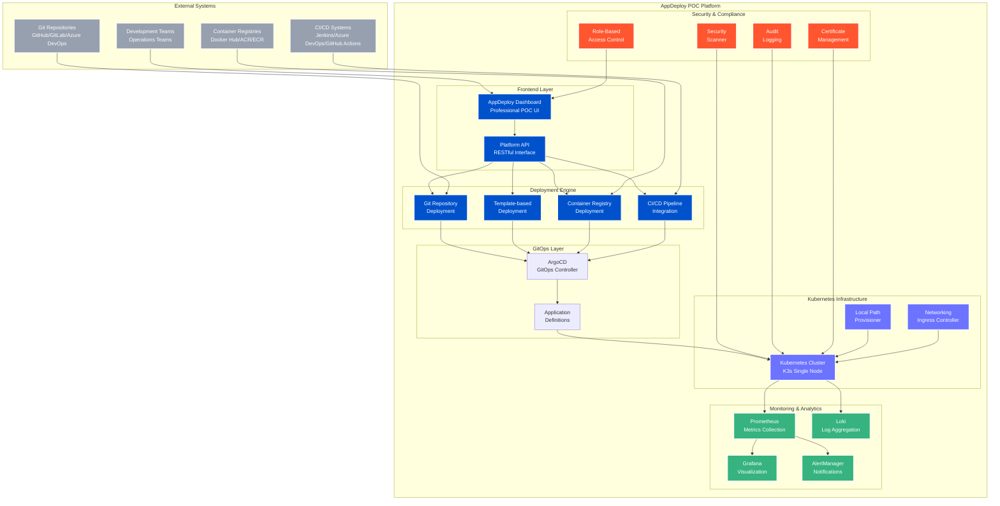

# AppDeploy POC Deployment Platform - Architecture

## Overview

AppDeploy POC is a proprietary, POC-grade deployment platform that provides a comprehensive one-stop-shop solution for application deployment, monitoring, and management. Built on top of Kubernetes and GitOps principles, it delivers POC features with a modern, professional interface.

## Architecture Diagram



## Component Architecture

### 1. Frontend Layer

#### AppDeploy Dashboard

- **Technology**: Modern HTML5/CSS3/JavaScript
- **Features**: Responsive design, real-time updates, POC branding
- **Authentication**: Kubernetes RBAC integration
- **Accessibility**: WCAG 2.1 compliant

#### Platform API

- **Technology**: RESTful API with OpenAPI specification
- **Security**: JWT tokens, rate limiting, audit logging
- **Integration**: Kubernetes API server proxy
- **Documentation**: Auto-generated API documentation

### 2. Deployment Engine

#### Git Repository Deployment

- **Supported Providers**: GitHub, GitLab, Azure DevOps, Bitbucket
- **Features**: Webhook integration, branch protection, PR workflows
- **Security**: SSH key management, signed commits validation

#### Template-based Deployment

- **POC Templates**: React, Angular, .NET, Java Spring, Node.js
- **Customization**: Environment-specific configurations
- **Validation**: Schema validation, dependency checking

#### Container Registry Deployment

- **Supported Registries**: Docker Hub, ACR, ECR, Harbor
- **Security**: Vulnerability scanning, image signing verification
- **Optimization**: Multi-stage builds, layer caching

#### CI/CD Pipeline Integration

- **Platforms**: Jenkins, Azure DevOps, GitHub Actions, GitLab CI
- **Features**: Pipeline status monitoring, artifact management
- **Notifications**: Slack, Teams, email integration

### 3. GitOps Layer

#### ArgoCD Integration

- **Sync Policies**: Automated, manual, or policy-based
- **Health Checks**: Application health monitoring
- **Rollback**: Automated rollback on failure
- **Multi-cluster**: Support for multiple cluster management

### 4. Monitoring & Analytics

#### Metrics Collection

- **Prometheus**: Application and infrastructure metrics
- **Custom Metrics**: Business KPIs, SLA tracking
- **Retention**: Configurable retention policies

#### Visualization

- **Grafana**: Pre-built POC dashboards
- **Alerting**: Threshold-based alerting
- **Reporting**: Automated SLA reports

#### Log Management

- **Loki**: Centralized log aggregation
- **Querying**: LogQL for advanced log analysis
- **Retention**: Optimized log retention

### 5. Security & Compliance

#### Access Control

- **RBAC**: Kubernetes native RBAC
- **SSO Integration**: LDAP, Active Directory, SAML
- **MFA**: Multi-factor authentication support

#### Security Scanning

- **Container Scanning**: CVE detection and remediation
- **Policy Enforcement**: OPA Gatekeeper integration
- **Compliance**: SOC2, ISO27001, GDPR compliance tracking

#### Audit & Governance

- **Audit Logs**: Comprehensive audit trail
- **Change Management**: Approval workflows
- **Compliance Reports**: Automated compliance reporting

## POC Features

### High Availability

- **Multi-zone Deployment**: Cross-AZ deployment support
- **Load Balancing**: Intelligent traffic distribution
- **Disaster Recovery**: Automated backup and recovery

### Performance Optimization

- **Resource Management**: Intelligent resource allocation
- **Scaling**: Horizontal and vertical pod autoscaling
- **Caching**: Intelligent caching strategies

### Resource Management

- **Resource Monitoring**: Real-time resource tracking
- **Optimization**: Automated performance optimization recommendations
- **Allocation**: Resource allocation and management tools

### System Integration

- **Service Mesh**: Istio integration for advanced networking
- **Data Protection**: Velero backup integration
- **Secrets Management**: HashiCorp Vault integration

## Deployment Topology

### Single-Node Configuration

```ascii
┌─────────────────────────────────────────────────────────────┐
│                    AppDeploy Node                           │
├─────────────────────────────────────────────────────────────┤
│ AppDeploy Dashboard (Port 8080)                            │
│ ArgoCD (Port 30080)                                         │
│ Grafana (Port 30300)                                        │
│ Prometheus (Port 30090)                                     │
├─────────────────────────────────────────────────────────────┤
│ K3s Control Plane + Worker                                 │
│ ├── deployment-platform namespace                          │
│ ├── argocd namespace                                        │
│ ├── monitoring namespace                                    │
│ ├── security namespace                                      │
│ └── application namespaces                                  │
├─────────────────────────────────────────────────────────────┤
│ Local Path Provisioner                                     │
└─────────────────────────────────────────────────────────────┘
```

### Multi-Node Configuration

```ascii
┌─────────────────┐  ┌─────────────────┐  ┌─────────────────┐
│   Master Node   │  │   Worker Node   │  │   Worker Node   │
│                 │  │                 │  │                 │
│ Control Plane   │  │ AppDeploy       │  │ Applications    │
│ ArgoCD          │  │ Dashboard       │  │ Workloads       │
│ Monitoring      │  │ Ingress         │  │ Storage         │
└─────────────────┘  └─────────────────┘  └─────────────────┘
         │                     │                     │
         └─────────────────────┼─────────────────────┘
                               │
                    ┌─────────────────┐
                    │  Load Balancer  │
                    │  External DNS   │
                    └─────────────────┘
```

## Security Architecture

### Network Security

- **Network Policies**: Kubernetes-native network segmentation
- **TLS Encryption**: End-to-end encryption for all communications
- **Ingress Security**: Web Application Firewall (WAF) integration

### Identity & Access Management

- **Authentication**: Multi-factor authentication
- **Authorization**: Fine-grained RBAC policies
- **Session Management**: Secure session handling

### Data Protection

- **Encryption**: Data encryption at rest and in transit
- **Backup**: Automated encrypted backups
- **Recovery**: Point-in-time recovery capabilities

## Scalability & Performance

### Horizontal Scaling

- **Application Scaling**: Automatic horizontal pod autoscaling
- **Platform Scaling**: Multi-cluster federation support
- **Database Scaling**: Read replicas and sharding

### Platform Optimization

- **Caching**: Redis caching for API responses
- **CDN Integration**: Content delivery network support
- **Resource Optimization**: Intelligent resource allocation

### Monitoring & Observability

- **Metrics**: Comprehensive metrics collection
- **Tracing**: Distributed tracing with Jaeger
- **Logging**: Centralized logging with correlation IDs

## Compliance & Governance

### Regulatory Compliance

- **SOC2 Type II**: Security controls and audit trails
- **ISO27001**: Information security management
- **GDPR**: Data protection and privacy controls

### Change Management

- **Approval Workflows**: Multi-stage approval processes
- **Rollback Capabilities**: Automated rollback on failure
- **Audit Trails**: Comprehensive change tracking

### Risk Management

- **Vulnerability Management**: Automated vulnerability scanning
- **Policy Enforcement**: OPA Gatekeeper policies
- **Incident Response**: Automated incident detection and response
